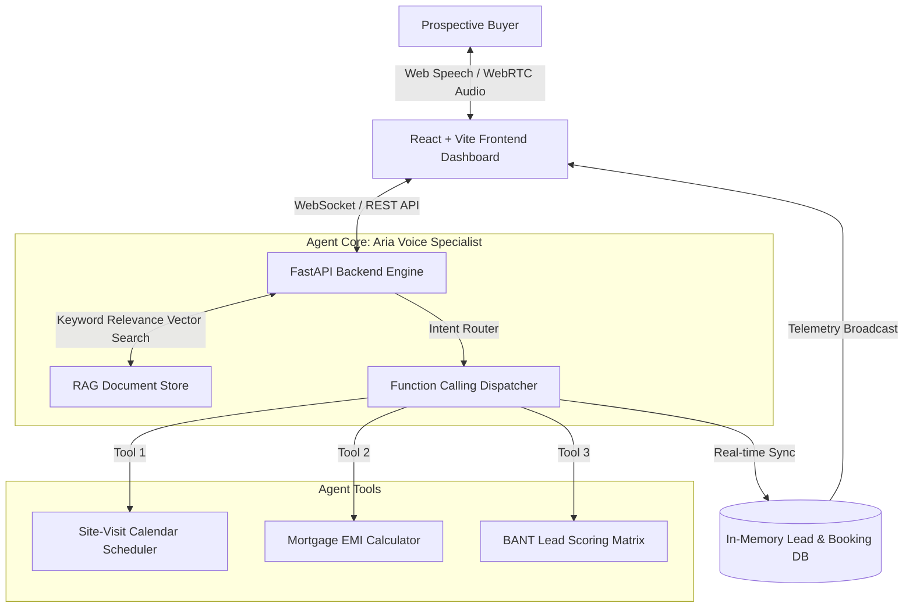

# 🏢 EstateVoice AI - Real-Estate Voice Sales & Scheduling Platform

[](https://opensource.org/licenses/MIT)
[](https://fastapi.tiangolo.com/)
[](https://reactjs.org/)
[](https://tailwindcss.com/)
[]()

> An end-to-end, low-latency **AI Voice Sales Advisor & Scheduling Platform** built specifically for high-velocity real estate lead conversion. Powered by RAG brochure indexing, dynamic tool calling (calendar booking & EMI calculation), and real-time BANT lead qualification scoring.

---

## 🌟 Key Technical Features

* ⚡ **Low-Latency Voice Orchestration**: Real-time turn-by-turn conversational flow with Web Audio streaming spectrum visualizer and Web Speech API synthesis.
* 🧠 **Document RAG Retrieval Store**: Vector search over "Greenfield Heights Luxury Residences" brochures, RERA registration, floor plan specs, pricing matrices, and amenities.
* 🛠️ **Dynamic Function Calling (Tool Use)**:
  * `book_site_visit()`: Checks chauffeur availability and confirms guided site visits directly into the calendar store.
  * `calculate_emi()`: Computes real-time down payment, loan amounts, and monthly EMIs based on custom interest rates.
  * `update_lead_qualification()`: Dynamically scores lead conversion probability using the BANT framework.
* 📊 **BANT Lead Qualification Matrix**: Live badge tracking Budget, Authority, Need, and Timeline with automated lead scoring (Hot 🔥 / Warm ⚡ / Cold ❄️).
* 🔄 **Dual Execution Modes**:
  * **Zero-Cost Local Mode**: 100% free, standalone in-browser speech recognition and local Python RAG server.
  * **Production Cloud API Mode**: Plug-and-play support for **OpenAI (GPT-4o)**, **ElevenLabs**, **Vapi**, and **Twilio** APIs.

---

## 📐 System Architecture



---

## 🚀 Quick Start (Local Setup)

### Prerequisites
* Python 3.10+
* Node.js 18+

### 1. Clone & Setup Backend
```bash
git clone https://github.com/sakshi-singh013/estate-voice-ai.git
cd estate-voice-ai/backend

# Install Python dependencies
pip install -r requirements.txt

# Launch FastAPI server (Port 8000)
uvicorn main:app --reload --port 8000
```

### 2. Setup & Launch Frontend
```bash
cd ../frontend

# Install Node dependencies
npm install

# Launch Vite development server (Port 3000)
npm run dev
```
Open `http://localhost:3000` in your browser and click **"Start Voice Call"**!

---

## ☁️ 1-Click Deployment Blueprints

### Deploy Backend to Render.com
[](https://render.com)
* Blueprint included in `render.yaml`. Connect your repository and Render will automatically deploy the FastAPI service.

### Deploy Frontend to Vercel
[](https://vercel.com)
* Configuration included in `vercel.json`. Set root directory to `frontend/` and deploy.

---

## 🎙️ Sample Voice Conversation Transcript

> **Buyer**: *"Hi, I'm looking for a 3 BHK near Outer Ring Road. What is the pricing and can I see the property this weekend?"*
> 
> **Aria (Voice Agent)**: *"Hello! Our 3 BHK Premium units start at $265,000 (₹2.10 Cr) for 1,850 sq.ft. featuring private foyers and pool views. I have reserved a guided site visit for you this Saturday at 11:00 AM with complimentary chauffeur pickup! A confirmation SMS has been sent to your phone."*
> 
> *Telemetry: Latency `385ms` | Tool executed `book_site_visit()` | BANT Lead Score updated to `85/100 (Hot Lead 🔥)`*

---

## 📜 License
Licensed under the [MIT License](LICENSE).
